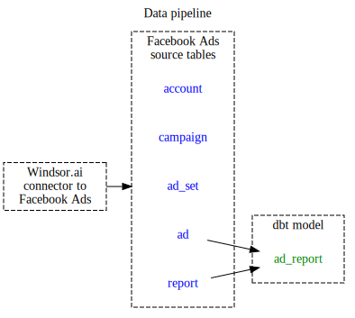
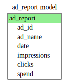
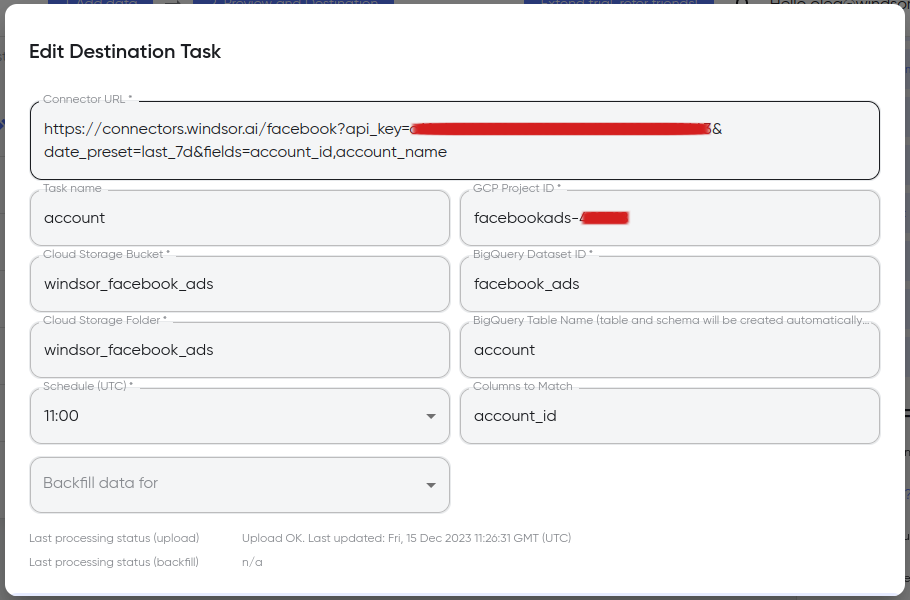
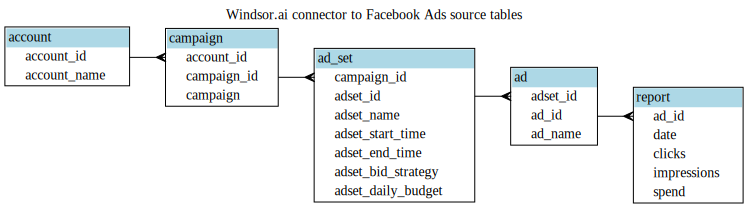

# What does this dbt package do?

Creates the dbt model described bellow using Facebook Ads data from [Windsor's connector](https://windsor.ai/connectors/facebook-ads/).



## Models

| **Model**                | **Description**                            |
| ------------------------ | -------------------------------------------|
| ad_report                | performance at the ad level               |




# How do I use the dbt package?

## Step 1: Create Facebook Ads source tables

To use this dbt package, you must [sync Facebook Ads data to BigQuery](https://www.youtube.com/watch?v=orkvTJH5VcI).
 - Add five destination tasks following the example below.
 


 - To import the following five tables. 
 


 - Using the following fields URL parameters in the Connector URL field.

| **Table**                | **Fields parameter**                            |
| ------------------------ | ------------------------------------------------|
| account                  | account_id,account_name                         |
| campaign                 | account_id,account_name,campaign_id,campaign    |
| ad_set                   | campaign_id,adset_id,adset_name,adset_start_time,adset_end_time,adset_bid_strategy,adset_daily_budget    |
| ad                       | adset_id,ad_id,ad_name                          |
| report                   | ad_id,date,clicks,impressions,spend             |

Details about Facebook Ad campaign structure is available [here](https://developers.facebook.com/docs/marketing-api/campaign-structure).
 

## Step 2: Install the package

1. Include the following dbt_facebook_ads package version in your packages.yml file.
```yaml
packages:
  - git: "https://github.com/Oleg-Solovyev/dbt_facebook_ads.git"
```
2. Run `dbt deps`.

## Step 3: Define the schema and tables variables
Add the following configuration to your root `dbt_project.yml`
```yml
vars:
  dbt_facebook_ads:
    report: '<facebook ads schema>.<report table>'
    ad: '<facebook ads schema>.<ad table>'
```
